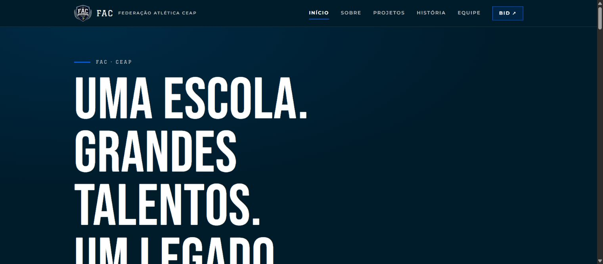
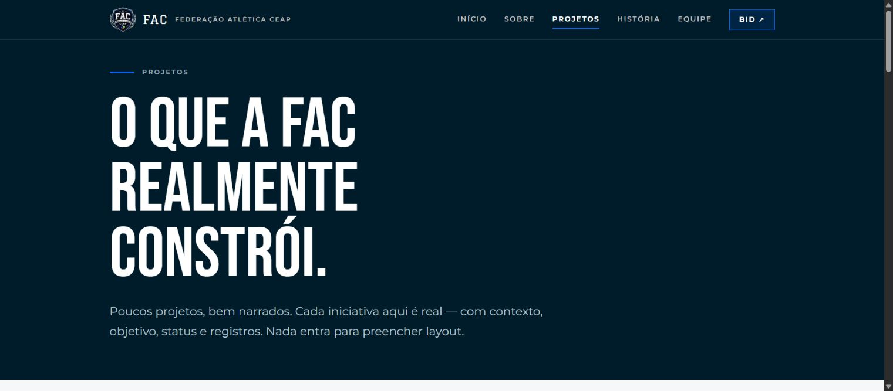
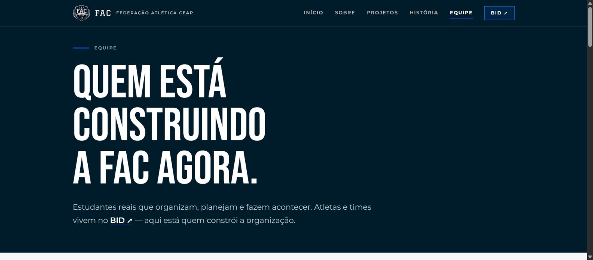
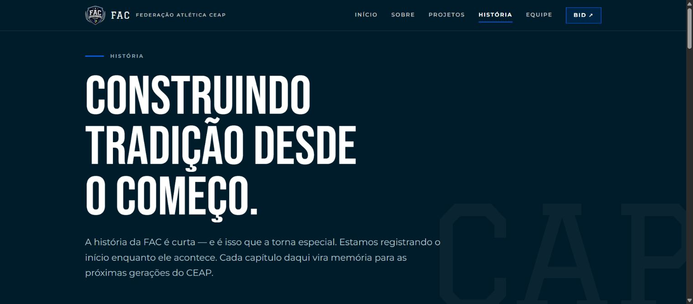

# Site Oficial da FAC - Federacao Atletica CEAP

Site institucional da **FAC - Federacao Atletica CEAP**, criado para apresentar identidade, historia, equipe, projetos e comunicacao oficial da entidade esportiva e cultural do CEAP.

Conceito: **Legado em movimento** - a tradicao esta sendo construida agora.

## Live Demo

https://fac-ceap.vercel.app

## Screenshots

| Home | Projetos |
| --- | --- |
|  |  |

| Equipe | Historia |
| --- | --- |
|  |  |

## Overview

| Area | Description |
| --- | --- |
| Problem | Uma entidade estudantil precisa de comunicacao clara, identidade propria e uma fonte oficial de informacoes. |
| Solution | Site institucional para explicar quem e a FAC, o que ela constroi, quem lidera e como os projetos se conectam. |
| Users | Alunos, lideranca estudantil, professores, comunidade CEAP e parceiros. |
| Focus | Produto institucional, design system, conteudo estruturado e evolucao por gestoes futuras. |

## Escopo

O site conta a organizacao e sua identidade:

- Inicio
- Sobre
- Projetos
- Historia
- Equipe
- Link externo para o BID

> Fronteira FAC x BID: o site FAC conta a organizacao, proposito, pessoas, historia e projetos. O BID cuida dos dados esportivos, como atletas, times, modalidades e resultados.

## Stack

- Next.js 16 com App Router
- React
- TypeScript
- Tailwind CSS v4
- Framer Motion

## Estrutura

```text
src/
  app/          rotas, layout e estilos globais
  components/   Header, Footer, Reveal, ImageSlot, SectionLabel, Container
  content/      dados editaveis sem mexer no layout
```

Conteudos repetiveis ficam em `src/content/`:

```text
src/content/site.ts      links institucionais
src/content/nav.ts       navegacao
src/content/projetos.ts  projetos
src/content/marcos.ts    linha do tempo
src/content/equipe.ts    lideranca e equipe
```

## Como Rodar

```bash
npm install
npm run dev
```

Acesse:

```text
http://localhost:3000
```

Validar build e lint:

```bash
npm run build
npm run lint
```

## Para Gestores Futuros

Todo conteudo repetivel foi centralizado em `src/content/`. Isso permite atualizar nomes, links, projetos e marcos sem alterar a estrutura visual do site.

Atualizacoes comuns:

- Links institucionais em `src/content/site.ts`.
- Nomes da equipe em `src/content/equipe.ts`.
- Datas e eventos em `src/content/marcos.ts`.
- Projetos em `src/content/projetos.ts`.

## Notas de Design

- Os slots de imagem usam proporcoes estaveis para facilitar troca futura de fotos.
- A estrutura separa conteudo e layout para reduzir risco de quebrar a interface.
- O projeto usa fontes substitutas abertas. Fontes oficiais podem ser adicionadas depois via `next/font/local`.

## Valor de Portfolio

Este projeto demonstra construcao de um produto institucional real: identidade, informacao, navegacao, conteudo editavel e preocupacao com continuidade por futuras gestoes.

Tambem reforca minha atuacao na FAC, conectando lideranca estudantil, comunicacao, organizacao e desenvolvimento web.
